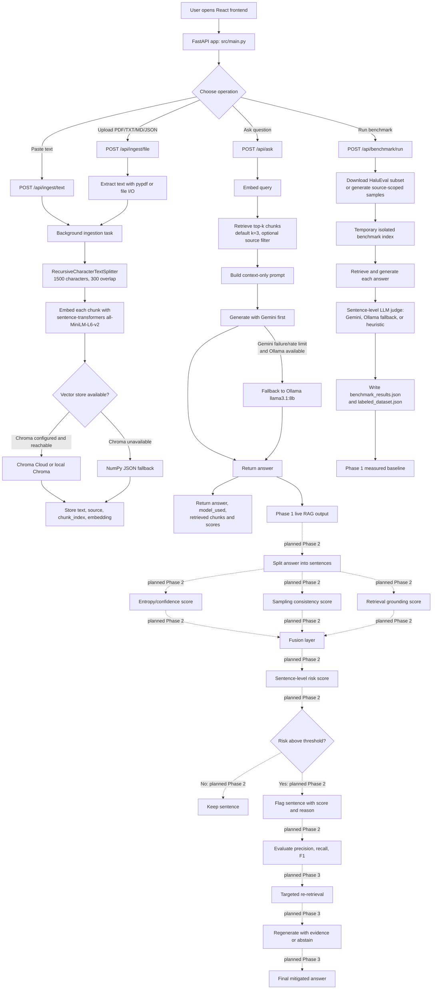

# HDRS Codebase Explanation

This document explains the current codebase end-to-end:

- how the backend works
- how the frontend works
- how documents are ingested and retrieved
- how the RAG pipeline is assembled
- how benchmark evaluation works
- which database is used
- how the current app flow fits together

This is written against the current implementation in the repository, not an idealized design.

## 1.1 Validated implementation workflow

The following diagram reflects the current code path. Phase 2 detection signals and
Phase 3 mitigation are shown as planned extension points from the development guide;
they are not implemented in the current application.



### Phase alignment

| Guide phase | Current repository status |
|---|---|
| Phase 1: working RAG and measured baseline | Core pipeline and benchmark workflow are implemented. Formal completion still depends on the required evaluation scope and presentation artifacts. |
| Phase 2: entropy, consistency, grounding, and fused risk score | Planned only; no live multi-signal detector is wired into the query path. |
| Phase 3: targeted correction or abstention | Planned only; no sentence-level mitigation loop is wired into the query path. |

The diagram deliberately does not present Phase 2 or Phase 3 as completed features.

### Phase 2 workflow: “We Can Catch It”

After the current Phase 1 RAG answer is generated, the planned Phase 2 detector
will process each sentence independently:

1. **Split the answer into sentences.**
2. **Calculate entropy/confidence** to estimate how uncertain the generator was.
3. **Calculate sampling consistency** by generating additional samples and checking
   whether the same claim is repeated.
4. **Calculate retrieval grounding** by comparing the sentence with the retrieved
   source chunks.
5. **Fuse the three signals** into one sentence-level hallucination risk score.
6. **Apply a validation-set threshold** and flag sentences above it.
7. **Report detector metrics** such as precision, recall, F1, and a confusion matrix.

The Phase 2 demonstration is:

```text
User question
  -> Phase 1 RAG answer
  -> sentence-level signal calculation
  -> fused risk score
  -> risky sentence flagged with score and reason
```

This detector is a planned extension. The current repository does not yet
calculate entropy, perform multi-sample consistency checking, compute a fused
risk score, or expose live flagged sentences in `/api/ask`.

---

## 1. High-Level Purpose

HDRS is a Phase 1 hallucination-detection RAG app.

Its goal is to:

1. ingest documents or pasted text
2. split them into chunks
3. embed and store those chunks in a vector database
4. answer user questions using only retrieved context
5. evaluate answers with an LLM judge for hallucination detection
6. show benchmark results and document-level source cards in the UI

The system is intentionally split into:

- a FastAPI backend in `src/`
- a React frontend in `frontend/src/`
- persistent vector storage using Chroma Cloud or local Chroma fallback

---

## 2. Backend Entry Point

The backend entry point is [`src/main.py`](D:\HDRS\src\main.py).

It creates the FastAPI app and exposes the REST API used by the frontend.

### Backend modularization

The backend is now modularized into smaller modules so the responsibilities are easier to maintain:

- [`src/api/app_factory.py`](D:\HDRS\src\api\app_factory.py) creates the FastAPI app and mounts routers
- [`src/api/routers/`](D:\HDRS\src\api\routers) contains the HTTP route handlers by feature area
- [`src/api/schemas.py`](D:\HDRS\src\api\schemas.py) holds the request models
- [`src/services/rag_pipeline.py`](D:\HDRS\src\services\rag_pipeline.py) contains the RAG workflow
- [`src/services/benchmark_service.py`](D:\HDRS\src\services\benchmark_service.py) contains benchmark orchestration and scoring
- [`src/core/settings.py`](D:\HDRS\src\core\settings.py) handles environment variables and config
- [`src/core/llm.py`](D:\HDRS\src\core\llm.py) handles Gemini and Ollama helpers
- [`src/core/chunker.py`](D:\HDRS\src\core\chunker.py) handles sentence-aware chunking
- [`src/core/prompts.py`](D:\HDRS\src\core\prompts.py) stores generation, judging, and benchmark prompt templates
- [`src/core/vector_store.py`](D:\HDRS\src\core\vector_store.py) handles Chroma Cloud, local Chroma, and NumPy fallback storage

The goal of this split is to keep the API layer thin and prevent prompt logic, storage logic, and config logic from being mixed together.

### Main responsibilities

- serve `/api/status`
- ingest documents via `/api/ingest/file` and `/api/ingest/text`
- answer RAG questions via `/api/ask`
- serve indexed documents via `/api/documents`
- clear the store via `/api/db/clear`
- run and report benchmark jobs via `/api/benchmark/run`, `/api/benchmark/status`, and `/api/benchmark/results`

The app also:

- mounts the static frontend build in production
- redirects to the Vite dev server when `HDRS_DEV_SERVER_URL` is set

---

## 3. Backend RAG Core

The main RAG logic lives in [`src/services/rag_pipeline.py`](D:\HDRS\src\services\rag_pipeline.py), with [`src/rag_core.py`](D:\HDRS\src\rag_core.py) kept as a compatibility wrapper.

This file handles:

- chunking text
- embedding text
- choosing the vector store
- retrieval
- answer generation
- fallback behavior

It is the central engine behind both normal chat and benchmark evaluation.

---

## 4. Database and Storage

### Current vector store choice

The app uses **ChromaDB**.

After the recent connection fix, the runtime prefers:

1. **Chroma Cloud** if `CHROMA_API_KEY` is set in `.env`
2. local Chroma persistent storage if cloud connection fails
3. NumPy JSON fallback only if ChromaDB itself is not available or the Chroma layer fails

### Current cloud connection behavior

The code in [`src/core/vector_store.py`](D:\HDRS\src\core\vector_store.py) does this:

- reads:
  - `CHROMA_HOST`
  - `CHROMA_API_KEY`
  - `CHROMA_TENANT`
  - `CHROMA_DATABASE`
- attempts `chromadb.CloudClient(...)`
- calls `heartbeat()` to fail fast if the connection is bad
- prints a startup message saying whether it connected to Chroma Cloud or fell back locally

### Local storage fallback

If cloud connection fails, the app falls back to:

- `chromadb.PersistentClient(path="data/chroma_db")`

That local data is stored under:

- [`data/chroma_db/`](D:\HDRS\data\chroma_db)

### What is stored in the vector DB

Each chunk stores:

- the chunk text
- metadata:
  - `source`
  - `chunk_index`
- an embedding vector
- a UUID

### Important note

The app does **not** currently have a separate SQL database.

The primary database is the Chroma vector store.

The benchmark outputs are stored as JSON files in `data/`:

- `benchmark_results.json`
- `benchmark_status.json`
- `labeled_dataset.json`

Those files are generated artifacts, not the main document database.

---

## 5. RAG Flow

The RAG flow is:

1. ingest document or text
2. chunk the text
3. embed each chunk
4. store chunks in Chroma
5. accept user query
6. embed the query
7. retrieve top-k similar chunks
8. generate answer from retrieved chunks only
9. return the answer and supporting chunks

### 5.1 Ingestion

In [`src/main.py`](D:\HDRS\src\main.py):

- `/api/ingest/file` accepts uploaded PDF/TXT/MD/JSON files
- `/api/ingest/text` accepts pasted text with a source name

Both call:

- `pipeline.ingest_text(...)`

### 5.2 Chunking

Chunking is handled by `SemanticChunker` in [`src/core/chunker.py`](D:\HDRS\src\core\chunker.py).

It:

- uses LangChain `RecursiveCharacterTextSplitter`
- prefers paragraph, newline, sentence, word, and character boundaries
- uses a 1500-character chunk size and 300-character overlap
- stores source and sequential chunk-index metadata

Each chunk gets metadata for its source and sequential chunk index.

### 5.3 Embedding

The app uses local sentence-transformer embeddings:

- model: `all-MiniLM-L6-v2`

Embedding happens through `embed_text(...)` in [`src/core/llm.py`](D:\HDRS\src\core\llm.py).

If the embedding model is unavailable or fails, the code returns a zero-vector
fallback; retrieval then uses lexical token-overlap fallback logic.

### 5.4 Retrieval

Retrieval happens in `RAGPipeline.retrieve(...)`.

It:

- embeds the query
- searches the vector store
- optionally filters by `source_filter`

### 5.5 Generation

Generation happens in `RAGPipeline.generate(...)`.

Rules enforced by the prompt:

- use only retrieved context
- do not use external knowledge
- if context is insufficient, say:
  - `I do not know based on the provided sources.`
- do not mention chunk IDs or dataset labels

Model routing in the current implementation:

- `model_name == "auto"` starts with Gemini generation
- if Gemini fails due to rate limiting/quota and Ollama is available, generation falls back to Ollama
- the benchmark judge follows the same Gemini-first pattern, then tries Ollama and finally a heuristic evaluator

### 5.6 Answer output

`RAGPipeline.ask(...)` returns:

- the query
- the generated answer
- the retrieved chunks
- the model used

---

## Recent debugging and robustness improvements

To address recent benchmark reliability and latency issues, the following conservative, Phase‑1-safe changes were added (preserve accuracy while improving diagnostics):

- Retrieval diagnostics
  - `RAGPipeline.retrieve(...)` now logs the top candidate scores and a short preview of each candidate. If the top-k scores are identical it emits a warning so embedding failures or static vectors can be detected quickly.
  - When lexical fallback is used (embedding missing or zero-vector), the top candidates and their scores are logged as well.

- Generation visibility
  - `_generate_source_benchmark_samples(...)` adds a `generation_method` field to each sample: either `"llm"` or `"template_fallback"`. This makes it trivial to see whether the LLM path is being used or a fallback was triggered.

- Timing separation
  - Benchmark worker now records `generation_time` and `judge_time` per sample (and logs both). This lets operators see whether slowdowns are caused by generation, judge, or retrieval.

- Concurrency and pacing
  - `BENCHMARK_CONCURRENCY` is honored and enforced (minimum 1). The benchmark logs the configured concurrency and warns if it is 1 so users can increase it for faster runs.
  - Retrieval is still serialized with a conservative lock to protect the vector store, but generation and judging run outside that lock so CPU/GPU-heavy LLM work can parallelize.

- Judge robustness
  - The judge logic (`evaluate_sentence_level`) now logs Ollama failures and includes retries for Gemini with backoff before falling back to a heuristic evaluator. Each fallback logs the exception to make root causes visible.

- Category assignment
  - The label `abstain` is now derived post-generation: if the generated answer contains common abstention phrases the sample is labeled `abstain`, otherwise the original generation-time category is preserved. This prevents pre-generation mislabeling.

These changes are intentionally additive (new logs and fields) and do not alter the scoring or judgment logic beyond the requested category fix. They enable efficient debugging: run one long-document test and inspect logs (top candidate scores, generation_method, gen/judge timings) to identify whether static retrieval, embedding failures, or LLM hardware limits are the root cause.


The frontend uses this for grounded chat and for showing source passages.

---

## 6. Backend API Details

### `GET /api/status`

Returns runtime diagnostics, including:

- vector store type
- vector store connection mode
- whether ChromaDB is available
- indexed chunk count
- Gemini config state
- Ollama availability
- active generator and judge model

This is the fastest way to verify whether the app is connected to Chroma Cloud or local storage.

### `POST /api/ingest/file`

Uploads a file and indexes it.

Supported file types:

- PDF
- TXT
- MD
- JSON

### `POST /api/ingest/text`

Ingests pasted text with a user-provided source name.

### `POST /api/ask`

Runs the RAG query pipeline:

- retrieve relevant chunks
- generate grounded answer
- return answer and retrieved chunks

### `GET /api/documents`

Returns all indexed sources grouped by source name.

The frontend uses this to build source cards.

### `POST /api/db/clear`

Clears the vector database and resets benchmark artifacts.

### `DELETE /api/documents/{source_name}`

Deletes all chunks for one source.

If the database becomes empty, benchmark artifacts are also reset.

### Benchmark endpoints

`POST /api/benchmark/run`

- triggers benchmark execution in the background

`GET /api/benchmark/status`

- reports progress and status

`GET /api/benchmark/results`

- loads the latest benchmark summary and sample case studies

---

## 7. Benchmark Flow

Benchmark logic is in [`src/services/benchmark_service.py`](D:\HDRS\src\services\benchmark_service.py), with [`src/benchmark.py`](D:\HDRS\src\benchmark.py) kept as a compatibility wrapper.

### Two benchmark modes

The benchmark system supports:

1. **Baseline HaluEval mode**
2. **Source-scoped mode**

### 7.1 Baseline HaluEval mode

If no `source_filter` is selected:

- the benchmark downloads samples from the HaluEval QA dataset
- it indexes the reference knowledge into an isolated temporary vector store
- it runs question answering over that synthetic benchmark set
- it judges each generated answer sentence-by-sentence against the retrieved context
- it records the judge path used for each sample as `judge_method` (`ollama`, `gemini`, or `heuristic`)

### 7.2 Source-scoped mode

If a source is selected:

- the benchmark loads the text for that source from the current vector store
- it generates benchmark questions based on that text
- it creates an isolated temporary vector store containing only that source
- it runs evaluation against that single source
- it uses the same sentence-level judge and records the judge method per sample

This is important because it prevents the selected document benchmark from accidentally mixing in unrelated data.

### 7.3 Generated artifacts

The benchmark writes:

- `data/benchmark_results.json`
- `data/labeled_dataset.json`
  - per-sample labels, generated answers, and `judge_method`
- `data/benchmark_status.json`

### 7.4 Benchmark scoring

The benchmark computes:

- sentence-level hallucination rate
- answer-level hallucination rate
- average latency

Sentence-level rate:

- hallucinated sentences / total evaluated sentences

Answer-level rate:

- answers with at least one hallucinated sentence / valid answers

### 7.5 Judge behavior

The judge compares generated answer sentences against the reference knowledge passage and labels them as:

- `factual`
- `hallucinated`

This is how the UI gets per-sentence reasoning.

---

## 8. Frontend Entry Point

The frontend app shell is [`frontend/src/App.jsx`](D:\HDRS\frontend\src\App.jsx).

It owns:

- active tab state
- selected benchmark source state
- app-wide status polling
- toast notifications

Tabs:

- Home / Workspace
- Control Center
- Benchmark

The benchmark tab now preserves the selected source instead of clearing it on entry.

---

## 9. Frontend Workspace

The main workspace UI is in [`frontend/src/components/Workspace.jsx`](D:\HDRS\frontend\src\components\Workspace.jsx).

### What it shows

- hero and overview
- document cards
- upload actions
- chat panel for a selected document
- benchmark shortcuts

### Workspace data sources

It calls:

- `GET /api/documents`
- `GET /api/benchmark/results`
- `POST /api/ingest/file`
- `POST /api/ingest/text`
- `POST /api/ask`
- `DELETE /api/documents/{source}`

### Workspace behavior

Each source card:

- opens grounded chat for that source
- can open benchmark for that source
- can delete the source

The workspace is the main place where indexed sources are managed.

---

## 10. Frontend Control Center

The Control Center component handles ingestion and system actions.

It is used to:

- ingest content
- clear the database
- inspect system state

This is the operational panel for managing the library.

---

## 11. Frontend Benchmark Panel

The benchmark dashboard is in [`frontend/src/components/BenchmarkPanel.jsx`](D:\HDRS\frontend\src\components\BenchmarkPanel.jsx).

### What it does

- loads source cards from `/api/documents`
- lets the user click a source card
- shows the benchmark result for the selected source
- runs a new benchmark for that selected source
- displays summary charts and case studies

### Why the benchmark panel has a library view

This was added because the benchmark should not look like a single global score if the user selected a specific source.

Now the flow is:

1. show the source library
2. select a source
3. show the matching benchmark result
4. rerun benchmark if needed

### Scope protection

The panel compares:

- `results.summary.benchmark_scope`
- current selected source

If they don’t match, it warns the user instead of showing misleading results.

---

## 12. Current Database State

### Current runtime status

The runtime target is selected from `.env`: Chroma Cloud is attempted when its
credentials are configured, with local Chroma and then NumPy fallback behavior.
The active indexed-chunk count is runtime state and may be zero after a reset,
so the library can appear empty until a document is ingested again.

### Why `/api/documents` may return `[]`

That simply means there are currently no indexed sources in the active Chroma store.

The code is working if:

- `/api/status` reports `chroma_cloud`
- `/api/documents` responds successfully
- but returns an empty array

In that case, you just need to ingest new documents.

---

## 13. Important Functional Flow Summary

### Ingestion flow

1. user uploads file or pastes text
2. backend chunks and embeds the content
3. chunks are stored in Chroma Cloud or local Chroma
4. frontend refreshes document list

### Chat flow

1. user selects a source
2. user asks a question
3. backend retrieves top-k chunks from that source
4. backend generates a grounded answer
5. frontend displays answer and source context

### Benchmark flow

1. User opens the Benchmark tab.
2. Source cards load from `/api/documents`.
3. User selects a source (or chooses the baseline HaluEval set).
4. (Preview) The UI can request a small set of generated QA samples from `/api/benchmark/generate_samples` so the user can approve them before running the full benchmark.
5. When the benchmark runs, the backend creates a temporary RAG index, ingests the selected source (or HaluEval snippets), and for each sample:
   - run RAG retrieval (top-k chunks) and generate an answer via the configured LLM;
   - build a single string `retrieved_context` by joining the retrieved chunk texts and pass that to the judge;
   - the judge evaluates the generated answer sentence-by-sentence using the retrieved_context (only falling back to the short `reference_knowledge` snippet if the retrieved context is empty);
   - the system records per-sentence labels, judge method (Gemini/Ollama), latency, and whether the answer contains any hallucination.
6. After all samples are evaluated, the backend writes `data/benchmark_results.json` (summary) and `data/labeled_dataset.json` (full labeled dataset) and updates the status file.

Notes / recent fix

- The judge now uses the actual `retrieved_context` produced by the RAG pipeline (RAGPipeline.ask returns `retrieved_context`) and prefers it over the smaller `reference_knowledge` snippet. This avoids false-positive hallucination labels that can occur when the judge is accidentally given the narrow reference snippet instead of the retrieved passages.
- A non-persistent preview endpoint (`POST /api/benchmark/generate_samples`) was added for Phase 1 UI verification; it is read-only and reuses the same generation logic.
- The backend logs which generation and judge methods were used for each sample (logger.debug entries), so runs are traceable during development.

### Database flow

1. env vars decide Chroma Cloud vs local fallback
2. Chroma Cloud is used when `CHROMA_API_KEY` is available
3. local persistent Chroma is fallback
4. NumPy JSON is fallback only if Chroma itself fails

---

## 14. Operational Notes

- The backend uses environment variables loaded from `.env`
- `GOOGLE_API_KEY` is required for Gemini fallback generation and benchmark judging
- `OLLAMA_MODEL` and `OLLAMA_BASE_URL` control local generation
- `CHROMA_HOST`, `CHROMA_API_KEY`, `CHROMA_TENANT`, and `CHROMA_DATABASE` control Chroma Cloud
- The frontend Vite dev server proxies `/api` to `http://localhost:8000`

If the frontend shows `ECONNREFUSED` on `/api/*`, the backend is not reachable on port `8000` yet.

---

## 15. Files Worth Reading

- [`src/main.py`](D:\HDRS\src\main.py)
- [`src/rag_core.py`](D:\HDRS\src\rag_core.py)
- [`src/benchmark.py`](D:\HDRS\src\benchmark.py)
- [`src/api/app_factory.py`](D:\HDRS\src\api\app_factory.py)
- [`src/api/schemas.py`](D:\HDRS\src\api\schemas.py)
- [`src/api/routers/status.py`](D:\HDRS\src\api\routers\status.py)
- [`src/api/routers/ingest.py`](D:\HDRS\src\api\routers\ingest.py)
- [`src/api/routers/chat.py`](D:\HDRS\src\api\routers\chat.py)
- [`src/api/routers/documents.py`](D:\HDRS\src\api\routers\documents.py)
- [`src/api/routers/benchmark.py`](D:\HDRS\src\api\routers\benchmark.py)
- [`src/core/settings.py`](D:\HDRS\src\core\settings.py)
- [`src/core/llm.py`](D:\HDRS\src\core\llm.py)
- [`src/core/chunker.py`](D:\HDRS\src\core\chunker.py)
- [`src/core/prompts.py`](D:\HDRS\src\core\prompts.py)
- [`src/core/vector_store.py`](D:\HDRS\src\core\vector_store.py)
- [`src/services/rag_pipeline.py`](D:\HDRS\src\services\rag_pipeline.py)
- [`src/services/benchmark_service.py`](D:\HDRS\src\services\benchmark_service.py)
- [`frontend/src/App.jsx`](D:\HDRS\frontend\src\App.jsx)
- [`frontend/src/components/Workspace.jsx`](D:\HDRS\frontend\src\components\Workspace.jsx)
- [`frontend/src/components/BenchmarkPanel.jsx`](D:\HDRS\frontend\src\components\BenchmarkPanel.jsx)
- [`frontend/src/components/ControlCenter.jsx`](D:\HDRS\frontend\src\components\ControlCenter.jsx)

---

## 16. Final Takeaway

The current HDRS codebase is a working Phase 1 RAG system with:

- document ingestion
- source-scoped retrieval
- grounded answer generation
- benchmark evaluation
- Chroma Cloud-backed storage

The biggest architectural ideas are:

- keep retrieval strictly source-scoped
- keep generation context-only
- keep benchmark results tied to a selected source
- keep the active database visible through `/api/status`
